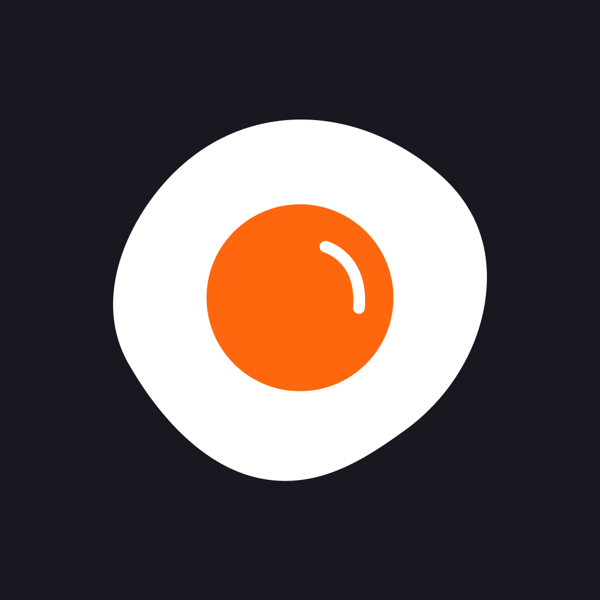

     
    

## 🍳 뭐먹었지?

식사를 특별하게. 오늘 뭐 먹었는지 기록하고, 나만의 식사 패턴을 발견해보세요.

#### 📸 음식 기록하기

사진과 함께 먹은 장소, 메모를 남겨 나만의 푸드 다이어리를 완성해보세요.

#### 📅 캘린더로 보기

주간, 월간 캘린더로 한눈에 내 식사 기록을 확인할 수 있어요.

#### 📊 인사이트

주차별 통계와 위치 기반 분석으로 나의 식습관을 되돌아보세요.

## 💻 Environment

- iOS 18.0 ~
- Xcode 16 ~
- Swift 5.9 ~

## ⚒️ Tech Spec

### Architecture

- Clean Architecture
- MVVM

### DI

- Swinject

### UI

- UIKit
- SnapKit
- Combine

### Async Programming

- Swift Concurrency

### Image

- Kingfisher
- TensorFlowLite

### Build

- Tuist
- SPM

### ETC

- Firebase (Core, Messaging)
- SwiftLog
